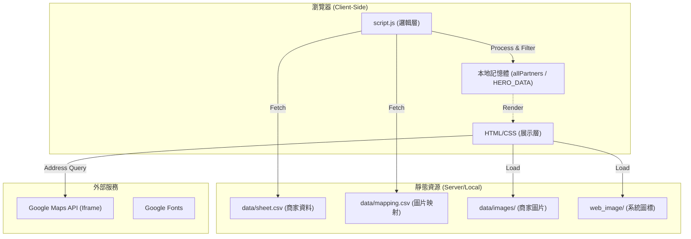
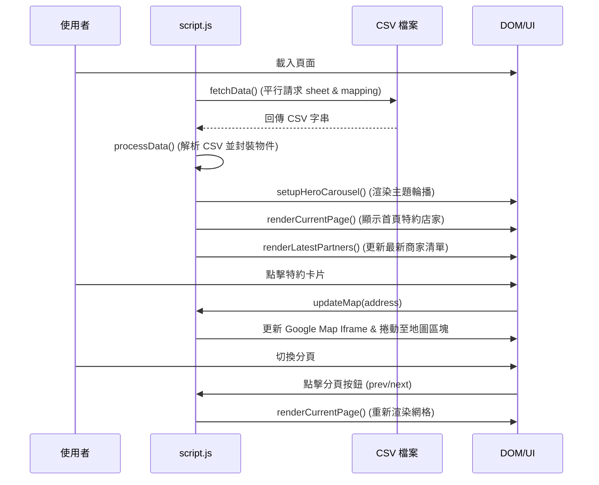

# 學生會特約店家

## 專案總覽（Project Overview）

- **專案用途**：展示國立臺中教育大學學生會與校園周邊店家合作的特約資訊。
- **解決的問題**：提供學生直觀、易用的介面，快速查詢特約優惠、商家內容與地理位置，取代傳統繁瑣的表格。
- **使用對象**：國立臺中教育大學在校學生與教職員。
- **專案性質**：靜態網頁應用（Web App），資料透過 CSV 檔案與本地圖片庫進行驅動。

## 系統架構說明（Architecture Overview）

專案基於傳統的網頁技術（HTML/CSS/JS）構建，採用資料驅動（Data-Driven）的設計模式，所有內容動態從 CSV 檔案載入並渲染至 DOM 節點中。

### 模組職責劃分

- **展示層 (HTML/CSS)**：定義網頁佈局、輪播組件、特約卡片樣式（Coupon Style）與響應式設計。
- **邏輯層 (JS)**：負責資料抓取（Fetch API）、CSV 解析、頁面渲染、Hero 輪播邏輯、分頁控制與 Google Maps 互動。
- **資料層 (CSV)**：提供特約內容（`sheet.csv`）與圖片映射關係（`mapping.csv`）。

### Mermaid 系統架構圖

## 系統流程說明（System Flow）

系統執行流程主要聚焦於資料的同步與渲染循環。

### Mermaid 流程圖

## 資料夾結構說明（Folder Structure）

- `data/`：存放所有驅動網頁內容的資料。
  - `images/`：存放特約店家的實體圖片。
  - `mapping.csv`：負責聯繫商家名稱與其對應圖片檔名的對照表。
  - `sheet.csv`：主資料檔案，包含名稱、優惠名稱、具體內容、地址、電話。
- `web_image/`：系統介面使用的裝飾性圖片或 Icon。
- `index.html`：網頁架構主體與各區塊佈局。
- `script.js`：核心邏輯處理，包含資料生命週期管理。
- `styles.css`：定義色彩、排版、Coupon 卡片視覺效果與手機版適配。
- `Design/`：可能包含原始設計草稿或規劃（由子目錄數量判斷）。
- `.github/`：包含自動化部署或 CI 控制腳本。

## 核心模組與重要檔案（Key Modules & Files）

- **`index.html`**：
  - 職責：靜態骨架，預留 JS 注入點（如 `#hero-slides-container`, `#partners-grid`）。
- **`script.js`**：
  - `fetchData()`：執行非同步資料請求。
  - `processData()`：解析 CSV，處理資料遺漏值，並將圖片與商家資訊結合為 `HERO_DATA`。
  - `renderCurrentPage()`：分頁核心，每頁固定顯示 6 個物件（`ITEMS_PER_PAGE = 6`）。
  - `updateMap(address)`：動態更新地圖載入內容。
- **`styles.css`**：
  - 提供 `--accent`（校園主題色）等變數。
  - 實作 `.partner-card`（仿優惠券票卡視覺）。

## 安裝與環境需求（Installation & Requirements）

- **系統需求**：現代化網頁瀏覽器（Chrome, Edge, Firefox, Safari）。
- **語言與版本**：純 HTML5 / CSS3 / JavaScript (ES6+)。
- **相依套件**：無（外部字型透過 Google Fonts 連結）。
- **環境變數**：尚未定義（目前為全靜態處理）。

## 使用方式（How to Use）

1. **本地預覽**：直接使用瀏覽器開啟 `index.html`。
2. **資料更新**：
   - 若需更新商家資訊，請修改 `data/sheet.csv`。
   - 若需更換或新增商家圖片，請將圖片放入 `data/images/` 並同步更新 `data/mapping.csv` 中的檔名映射。
3. **地圖操作**：點擊任何商家卡片，系統會自動定位該商家地址並更新下方地圖。

## 設定說明（Configuration）

`script.js` 中包含幾項關鍵設定常數：

- `ITEMS_PER_PAGE`：定義每頁顯示的特約店家數量（預設為 6）。
- `CSV_URL` & `MAPPING_URL`：資料來源路徑。
- `IMAGE_BASE_PATH`：圖片庫基礎路徑。

## 開發者指南（Developer Guide）

- **建議閱讀順序**：
  1. `data/` 內的 CSV 檔案：理解資料如何定義。
  2. `script.js`：理解資料如何被解析。
  3. `index.html`：理解渲染目標。
- **注意事項**：
  - CSS 採用大量的 Flex 與 Grid 進行佈局，修改佈局時請注意響應式媒體查詢（Media Queries）。
  - Data 的 CSV 解析採用簡易的 `.split(',')`，需確保資料中不含額外的逗號，否則會解析位移。建議後續改用更健全的 CSV 解析函式。

## 已知限制與待辦事項（Limitations & TODO）

- **解析限制**：目前 CSV 解析不支援欄位內含逗號（Quoted strings）。
- **資料效能**：目前採全量載入 (Full Fetch)，資料量極大時（>1000家）可能影響載入速度。
- **TODO**：
  - [ ] 增加分類篩選功能（目前 JS 已有 `category` 屬性但 UI 未實作篩選）。
  - [ ] 搜尋功能：允許學生透過名稱或關鍵字搜尋店家。
  - [ ] 圖片延遲載入 (Lazy loading)：提高頁面首屏載入效能。

## 補充說明（Notes）

- **快取機制**：由於是 Fetch CSV，內容更新可能受到瀏覽器快取影響，更新資料後建議強制刷新（Ctrl+F5）。
